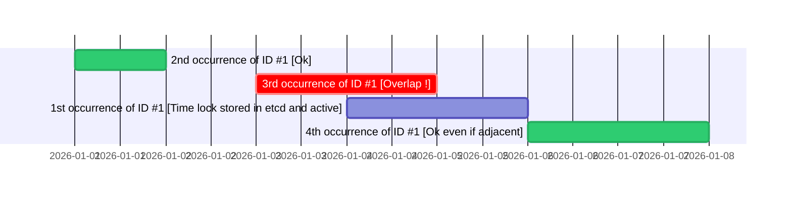

Let us consider the following use cases :
1. A patient cannot register online for two appointments with the same doctor within less than 24 hours.
2. A tennis court reservation can be extended but also has to be confirmed no later than 15 minutes after the start of the time slot.
3. Daily billing in an airport parking lot, with processing by the system and therefore billing to take place no more than 6 months later.

The Timegate module makes sure that the business processing of such events will take place only once and in due time.  
The workflows responsible for processing use the Timegate.Check function to set a time lock that gets stored in an etcd database :

```
Timegate.Check(id string, // Event ID
    timestamp time.Time, // Event timestamp
    before time.Duration, // Period of time before the timestamp - Start of the locked time window
    after time.Duration, // Period of time after the timestamp - End of the locked time window
    maxValidity time.Duration, // How long after the timestamp the time lock is stored and active
) (*Result, error)
```

This lock can only be obtained if there is no event in the database with the same ID and an incompatible time window, that is, overlapping the requested one as shown below.



Back to the examples :

1. Thus, a patient cannot register for a second appointment at 10:00 AM the following day ; with already another appointment at 7:00 PM the day before. Nor can the patient register for another appointment at 4 PM the same day.

The first lock is requested with the following parameters :

`Timegate.Check(patient ID + doctor ID, day at 7 PM, 12H, 12H, 12H)`

Therefore, the following calls will trigger a 'RejectOverlap' rejection :

`Timegate.Check(patient ID + doctor ID, day+1 at 10 AM, 12H, 12H, 12H)`

`Timegate.Check(patient ID + doctor ID, day at 4 PM, 12H, 12H, 12H)`

24 hours later, the '7 PM' lock gets removed and it is possible to register again for another appointment from that time onwards.

2. For a tennis court reservation at 4 PM for 1 hour, valid no later than 15 minutes after the start of the time slot, the parameters are :

`Timegate.Check(court number, day at 4 PM, 0, 1H, 15 Minutes)`

For a reservation confirmed on time, the function can be called a second time to reserve the rest of the time slot :

`Timegate.Check(court number, day at 4:15 PM, 0, 45 Minutes, 45 Minutes)`

Otherwise, another player may request to use the court for the remaining time :

`Timegate.Check(court number, day at 4:18 PM, 0, 42 Minutes, 42 Minutes)`

Finally, if the player confirmed their reservation on time and wishes to extend it for another hour :

`Timegate.Check(court number, day at 5 PM, 0, 1H, 1H)`

To make it possible to confirm or extend a reservation the Timegate is configured to accept contiguous time intervals (the NewTimeGate constructor is invoked with 'AdjacentAllowed' parameter by default).

3. For daily parking billing with processing within a maximum of 6 months :

`Timegate.Check(parking lot number, day at 0:00, 0, 24h, 6 months)`

If the vehicle enters and exits the parking lot several times that day, it will only be billed once, for the entire day, even though the events corresponding to its repeated entries and exits may have been communicated to the processing system with some delay. But not more than 6 months later in order for the time lock request not to be rejected with a 'RejectTooOld' reason.

Technically, the Timegate module relies on an etcd database to **benefit from distributed lock management within a cluster** such as Kubernetes ; where processing workflows would be deployed as containers.

**About timestamps without a time window :**  

Singleton time locks are possible. However, the call `Timegate.Check(ID, timestamp, 0, 0, maxValidity)` is meaningful and permitted only for a Timegate instantiated in 'AdjacentNotAllowed' mode.

Finally, the `Rollbacklease` function makes it possible to remove a time lock by specifying its lease ID and key.

**Notes :**
- In case of a processing workflow crash, and provided that the lease ID and key have been logged, it is possible to manually remove an orphaned time lock using commands such as `etcdctl lease revoke <lease_id>` and `etcdctl del <mykey>`
- For examples on how to use the Timegate module, please have a look a the unit tests file
